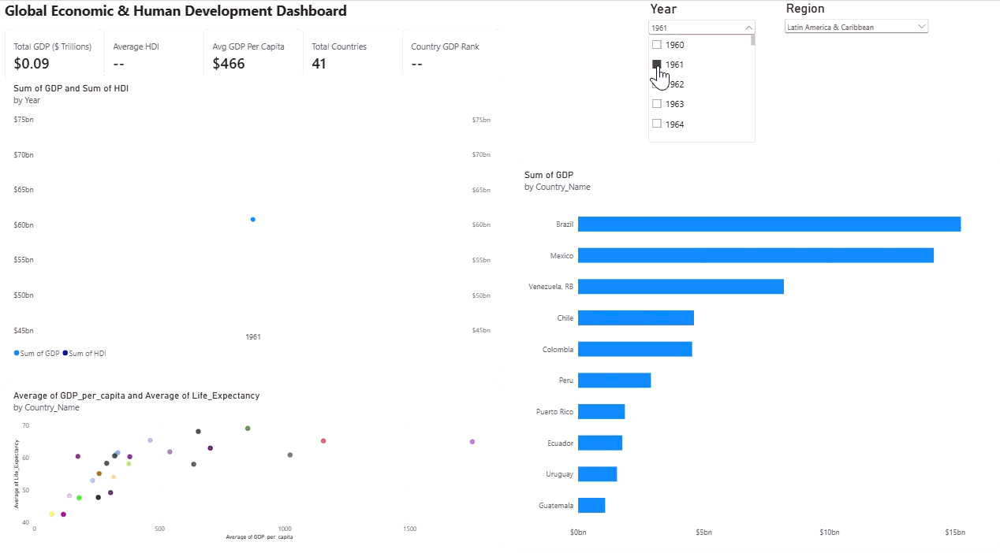
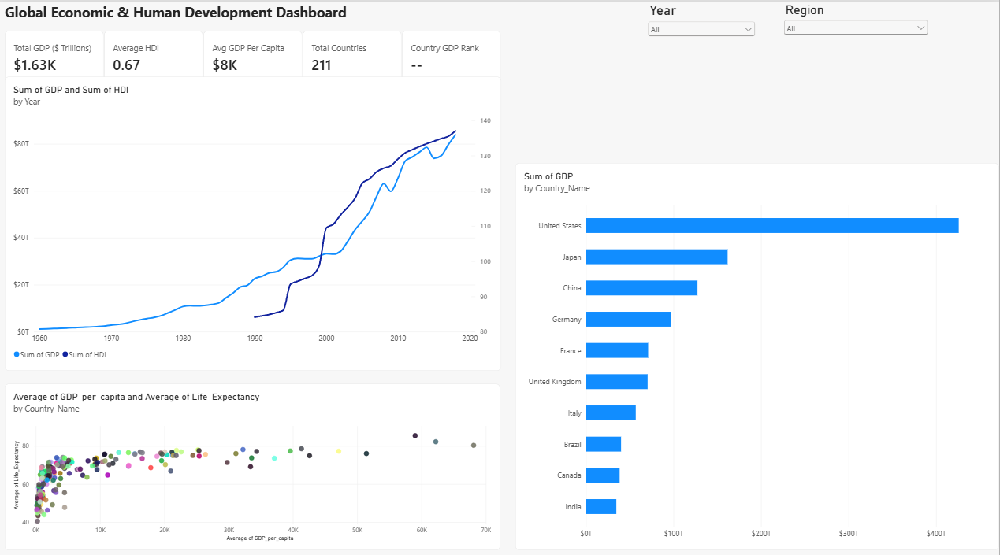

# 🌍 Global Economic & Human Development Data Pipeline & Power BI Dashboard

An end-to-end data analytics project processing historical global socio-economic indicators across 200+ countries. This project demonstrates a full data pipeline—from raw Excel/CSV data extraction and Python automated cleaning to relational SQLite database architecture and interactive Power BI executive reporting.

---

## 📊 Dashboard Overview & Interactive Demo

### Live Interactive Preview


### Static Executive View


---

## 🚀 Project Architecture & Workflow

[Raw CSV / Excel Data] ➔ [Python Jupyter Notebook] ➔ [SQLite Database] ➔ [SQL Query Layer] ➔ [Power BI Analytics]

1. **Extraction & Transformation (`pipeline.ipynb`):**
   - Ingested multi-year global development datasets (`GDP`, `HDI`, `Life Expectancy`, `Population`, `GDP per Capita`) from `WorldBank.xlsx` and `HDI.csv`.
   - Handled missing values, formatted dynamic data types, and standardized country codes and metric structures using `pandas`.
   - Exported clean, structured datasets to `world_indicators_cleaned.csv`.
2. **Relational Data Warehousing (`world_indicators.db`):**
   - Formatted cleaned data into structured relational tables using Python’s `sqlite3` and `sqlalchemy`.
   - Optimized data types to support efficient SQL querying and DAX aggregations.
3. **Analytical Query Layer (`analysis_queries.sql`):**
   - Executed analytical SQL queries to validate aggregates, country ranks, and multi-year economic trends prior to BI layer integration.
4. **Data Modeling & Visualization (`World_Indicators_Dashboard.pbix`):**
   - Designed a star-schema architecture with a dedicated DAX measures table.
   - Authored dynamic DAX measures for real-time aggregation across regional and temporal slices.
   - Built a balanced 2-column executive layout featuring high-level KPIs, dual-axis trend analysis, Top 10 rankings, and socio-economic scatter plot distributions.

---

## 📈 Key Insights & Analytical Features

- **Executive KPI Banner:** Instant visibility into aggregate metrics including **Total GDP ($ Trillions)**, **Average HDI**, **Avg GDP Per Capita**, **Total Countries**, and dynamic **Country GDP Rank**.
- **Economic vs. Social Trends (Dual-Axis Line Chart):** Tracks the long-term correlation between total global wealth generation (GDP) and human development indices (HDI) across decades.
- **Top 10 Global Economies (Clustered Bar Chart):** Utilizes dynamic Power BI Top-N filtering by total GDP to isolate leading economic contributors in a clean, unified single-color palette.
- **Socio-Economic Distribution (Scatter Plot):** Correlates Average GDP per Capita against Average Life Expectancy to evaluate standard-of-living returns across developing vs. developed nations.
- **Interactive Global Slicers:** Allows seamless filtering across specific **Years** and **Regions** for deep-dive regional analysis.

---

## 🛠️ Tech Stack & Skills Demonstrated

- **Languages:** Python (Pandas, NumPy, SQLite3), SQL, DAX
- **Database:** SQLite
- **Business Intelligence:** Power BI Desktop
- **Data Governance:** Data Dictionary (`world_indicators_data_dictionary.csv`)
- **Version Control:** Git, GitHub
- **Key Concepts:** ETL Pipelines, Data Hygiene, Relational Modeling, Window Functions, Dashboard UX/UI Design

---

## 🧮 DAX Measures Implemented

```dax
// Total GDP
Total GDP ($ Trillions) = SUM(world_indicators_cleaned[GDP]) / 1E12

// Average HDI
Average HDI = AVERAGE(world_indicators_cleaned[HDI])

// Avg GDP Per Capita
Avg GDP Per Capita = AVERAGE(world_indicators_cleaned[GDP_per_capita])

// Total Countries
Total Countries = DISTINCTCOUNT(world_indicators_cleaned[Country_Name])

// Dynamic Country GDP Rank
Country GDP Rank = 
IF(
    HASONEVALUE(world_indicators_cleaned[Country_Name]),
    RANKX(
        ALLSELECTED(world_indicators_cleaned[Country_Name]),
        [Total GDP ($ Trillions)],
        ,
        DESC
    ),
    BLANK()
)
```
---

## 📁 Repository File Structure

```text
.
├── World_Indicators_Dashboard.pbix     # Interactive Power BI Report
├── pipeline.ipynb                      # Jupyter Notebook for ETL cleaning & DB ingestion
├── world_indicators.db                 # SQLite Relational Database
├── world_indicators_cleaned.csv        # Processed & cleaned dataset
├── WorldBank.xlsx                      # Raw World Bank economic indicators
├── HDI.csv                             # Raw Human Development Index data
├── analysis_queries.sql                # Analytical SQL queries
├── world_indicators_data_dictionary.csv# Schema definition & data dictionary
├── dashboard_preview_live.gif          # Animated dashboard demo
└── dashboard_overview.png              # High-res static screenshot
```
